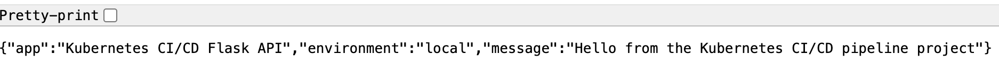
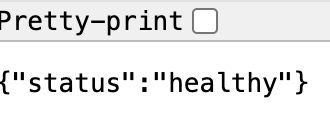
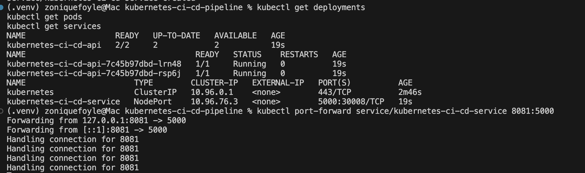
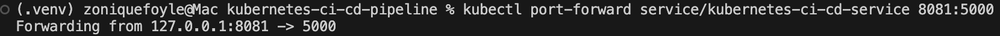

# Kubernetes CI/CD Pipeline

A Flask API deployed to Kubernetes with automated validation using GitHub Actions, Docker, and Kubernetes manifests.

This project was built to better understand what happens after a container is created. In earlier projects, I focused heavily on infrastructure automation using Terraform, Python, and AWS services. I could provision infrastructure, automate cloud resources, and deploy applications, but I wanted a deeper understanding of how containerized applications are actually managed and orchestrated at scale.

Instead of stopping at Docker, I wanted to learn how Kubernetes handles deployments, replicas, networking, and service discovery in a more production-style workflow. I also wanted to understand how CI/CD pipelines fit into that process and how deployment validation can be automated through GitHub Actions.

A simple Flask API was intentionally chosen because the focus of this project was not backend application complexity. The goal was to focus on container orchestration, deployment workflows, Kubernetes resources, and CI/CD automation without unnecessary framework overhead.

## Why Kubernetes Instead of Only Docker

Docker solves the problem of packaging applications consistently, but Kubernetes solves the problem of managing those containers once applications begin scaling across environments.

Running a single Docker container locally is straightforward, but production systems typically require:

- multiple replicas
- service discovery
- workload orchestration
- health management
- deployment consistency
- automated recovery

Kubernetes introduces additional complexity, but it also provides the orchestration layer that modern cloud environments rely on.

This project helped bridge the gap between simply building containers and understanding how those containers are deployed and managed in distributed systems.

## Why GitHub Actions

I chose GitHub Actions because CI/CD pipelines are now part of nearly every modern DevOps workflow.

Instead of manually validating Kubernetes resources and deployment files every time changes are made, GitHub Actions automates that process directly inside the repository. This creates a cleaner and more repeatable workflow while also reinforcing infrastructure validation practices used in real engineering environments.

I also wanted to better understand how automation pipelines integrate with Kubernetes-based application deployments.

## Project Goals

The main goals of this project were:

- Learn Kubernetes deployment workflows
- Understand deployments, pods, replicas, and services
- Practice Kubernetes networking and port forwarding
- Deploy containerized applications into a local Kubernetes cluster
- Build automated CI/CD validation workflows
- Gain hands-on experience troubleshooting Kubernetes resources
- Understand the relationship between Docker, Kubernetes, and CI/CD pipelines

## Architecture

Developer Push  
↓  
GitHub Actions Validation Workflow  
↓  
Docker Container Build  
↓  
Kubernetes Deployment  
↓  
Flask API Pods and Services

## Features

- Flask API containerized with Docker
- Kubernetes deployment and service manifests
- Replica-based pod deployment
- Local Kubernetes cluster using Docker Desktop
- GitHub Actions CI/CD workflow
- Automated Kubernetes manifest validation
- Health check endpoint
- Port forwarding for local testing
- Containerized local development workflow

## API Endpoints

### Root Endpoint

GET /

Example response:

```json
{
  "app": "Kubernetes CI/CD Flask API",
  "environment": "local",
  "message": "Hello from the Kubernetes CI/CD pipeline project"
}
```

### Health Endpoint

GET /health

Example response:

```json
{
  "status": "healthy"
}
```

## Running the Project

### Build the Docker image

```bash
docker build -t zonfoyle/kubernetes-ci-cd-api:latest .
```

### Apply Kubernetes resources

```bash
kubectl apply -f k8s/deployment.yaml
kubectl apply -f k8s/service.yaml
```

### Verify Kubernetes resources

```bash
kubectl get deployments
kubectl get pods
kubectl get services
```

### Port forward the service

```bash
kubectl port-forward service/kubernetes-ci-cd-service 8081:5000
```

### Access the application

```text
http://localhost:8081
```

### Health endpoint

```text
http://localhost:8081/health
```

## Project Structure

```text
kubernetes-ci-cd-pipeline/
│
├── .github/
│   └── workflows/
│       └── ci-cd.yml
│
├── k8s/
│   ├── deployment.yaml
│   └── service.yaml
│
├── screenshots/
│
├── app.py
├── Dockerfile
├── requirements.txt
├── README.md
└── .gitignore
```

## Screenshots

### Flask API Running in Kubernetes



### Health Endpoint



### Kubernetes Deployments and Services



### Kubernetes Port Forwarding



### Docker Desktop Kubernetes Dashboard


## Tradeoffs and Lessons Learned

One of the biggest tradeoffs in this project was choosing Kubernetes even though the application itself is intentionally simple.

For a lightweight Flask API, Kubernetes is significantly more complex than simply running Docker Compose locally. Setting up deployments, services, port forwarding, and cluster management introduces additional operational overhead that would not necessarily be required for a small standalone application.

That tradeoff was intentional.

The purpose of this project was not application complexity. The purpose was learning orchestration, deployment workflows, Kubernetes networking, and CI/CD integration in an environment that resembles modern cloud infrastructure practices.

Another important lesson was understanding how Kubernetes abstracts networking and workload management. Troubleshooting service exposure, port forwarding, and local cluster behavior helped reinforce how Kubernetes routes traffic internally between services and pods.

I also gained a much better understanding of how CI/CD workflows reduce manual validation work and help create more repeatable deployment processes.

## Future Improvements

- Push Docker images automatically to Docker Hub
- Add automated deployment stages in GitHub Actions
- Add Kubernetes liveness and readiness probes
- Deploy the application to Amazon EKS
- Add monitoring and observability tooling
- Add Helm chart support
- Add rolling deployment strategies
- Introduce multi-environment deployment workflows